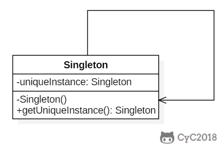

## 模式原理

目标：一个类只有一个实例。



## 模式实现

### 1. 饿汉式（线程安全）

> 所谓饿汉式，就是“我饿了”，不管是否需要获取对象，先实例化再说。

饿汉式虽然实现了线程安全，但是没有做到延迟实例化，在类初始化的时候就实例化对象，如果对象庞大，在某些场景下就不友好。

```java
class HungrySingleton {
    private static HungrySingleton instance = new HungrySingleton();

    private HungrySingleton() {
    }

    public static HungrySingleton getInstance() {
        return instance;
    }
}
```

### 2. 懒汉式（线程不安全）

> 所谓懒汉式，就是“我很懒”，用不到对象的时候就不实例化对象。

懒汉式和饿汉式相比，实现了对象的延迟实例化，但是又产生了线程安全问题。

```java
class LazySingleton {
    private static LazySingleton instance;

    private LazySingleton() {
    }

    public static LazySingleton getInstance() {
        if (instance == null) instance = new LazySingleton();
        return instance;
    }
}
```

### 3. 懒汉式（线程安全）

简单的懒汉式之所以线程不安全，就是因为 instance 是线程共享的 static 对象。

最简单粗暴的方法就是给 `getInstance()` 方法加锁，但是事实上加锁这个方法只在 instance 对象要实例化还没有被实例化的时候有用，对象实例化完成后加锁根本就是多余的，反而会增加开销。

```java
public static synchronized LazySingleton getInstance() {
    if (instance == null) instance = new LazySingleton();
    return instance;
}
```

### 4. 双重校验锁（线程安全）

双重校验锁的思想：加锁操作只在 instance 对象还没有被实例化的时候。

```java
class DoubleCheckLock {
    private volatile static DoubleCheckLock instance;

    private DoubleCheckLock() {
    }

    public static DoubleCheckLock getInstance() {
        if (instance == null)
            // #1
            synchronized (DoubleCheckLock.class) {
                if (instance == null) // #2
                    instance = new DoubleCheckLock(); // #3
            }
        return instance;
    }
}
```

#### 4.1 双重校验锁的锁

synchronized 在这里是类锁，即锁类的 class 对象，类中的所有静态方法和静态代码块会共享同一把锁。

#### 4.2 双重校验的原因

如果去掉第二个 if，把上面的代码改成：
```java
if (instance == null) {
    // #4
    synchronized (DoubleCheckLock.class) { //#5
        instance = new DoubleCheckLock(); // #6
    }
}
```

`#5` 加锁只是保证同一时刻不会有多个线程执行同步代码块，假设有两个线程同时到达了 `#4` 的位置，就注定两个线程都会执行 `#6`，只是因为锁对资源的控制而先后执行 `#6`。这样就没办法保证对象的唯一性了。而 `#2` 再加一个 if 判断，当一个线程完成了对象的实例化后释放了资源，另一个线程进入同步代码块，此时对象就不需要再实例化了。

#### 4.3 使用 volatile 关键字的原因

- 对象的实例化分为三步：1.分配内存空间 2.初始化对象 3.将对象指向分配的内存地址。
- JVM 有重排序，可能会改变执行顺序。线程 T1 执行了 1 和 3，此时 T2 调用 getInstance() 后发现 instance 不为空，因此返回 instance，但此时 instance 还未被初始化。
- 使用 volatile 关键字可以禁止重排序。

### 5. 静态内部类（线程安全）

静态内部类只会在调用时被加载，类加载的线程安全性由 JVM 保证，instance 只会被实例化一次。

```java
class OuterClass {
    private OuterClass() {
    }

    private static class InnerClass {
        private static final OuterClass instance = new OuterClass();
    }

    public static OuterClass getInstance() {
        return InnerClass.instance;
    }
}
```

### 6. 枚举

枚举类型的线程安全性也是由 JVM 保证。

```java
enum EnumSingleton {
    INSTANCE;

    private String name;

    public String getName() {
        return name;
    }

    public void setName(String name) {
        this.name = name;
    }

    public static void test5() {
        EnumSingleton instance = EnumSingleton.INSTANCE;
        instance.setName("Hex");
        EnumSingleton instance1 = EnumSingleton.INSTANCE;
        instance1.setName("H3x");
        System.out.println(instance.getName());
        System.out.println(instance1.getName());
    }
}
```

### 7. 反射破坏单例及解决办法

```java
    public static void test6() {
        LazySingleton instance1, instance2;
        Class<LazySingleton> clazz = LazySingleton.class;
        try {
            Constructor<LazySingleton> constructor = clazz.getDeclaredConstructor();
            constructor.setAccessible(true); // 设置构造器为可访问，即使它是私有的
            instance1 = constructor.newInstance();
            instance2 = constructor.newInstance();
        } catch (InvocationTargetException e) {
            throw new RuntimeException(e);
        } catch (NoSuchMethodException e) {
            throw new RuntimeException(e);
        } catch (InstantiationException e) {
            throw new RuntimeException(e);
        } catch (IllegalAccessException e) {
            throw new RuntimeException(e);
        }
        System.out.println(instance1 == instance2);
    }
```

解决办法：枚举实现的单例是最安全的，即使是反射也不能绕过 JVM 的机制。

### 8. 序列化破坏单例及解决办法

序列化底层也是通过反射调用无参构造实例化对象，所以序列化也能破坏单例。

```java
package com.hex.pattern.singleton;

import java.io.*;

/**
 * @Author: Hex
 * @Date: 2024/4/27 12:29
 * @Version: 1.0
 * @Description: 序列化破坏单例
 */
class Singleton implements Serializable {
    private static final long serialVersionUID = 1L;
    private static Singleton instance;

    private Singleton() {
    }

    public static synchronized Singleton getInstance() {
        if (instance == null) instance = new Singleton();
        return instance;
    }

    /**
     * 序列化破坏单例模式
     */
    public static void main(String[] args) throws IOException, ClassNotFoundException {
        Singleton instance = Singleton.getInstance();
        System.out.println(instance); // Singleton@4554617c
        // 写序列化文件
        FileOutputStream fos = new FileOutputStream("singleton.ser");
        ObjectOutputStream oos = new ObjectOutputStream(fos);
        oos.writeObject(instance);
        oos.close();
        fos.close();

        // 读序列化文件
        FileInputStream fis = new FileInputStream("singleton.ser");
        ObjectInputStream ois = new ObjectInputStream(fis);
        Singleton deserializedInstance = (Singleton) ois.readObject();
        ois.close();
        fis.close();

        System.out.println(deserializedInstance); // Singleton@5fd0d5ae
    }
}
```

解决办法：在反序列化过程中 `readResolve()` 方法会被调用，并返回通过 `getInstance()` 方法获取的单例实例，从而确保单例的约束不被破坏。
```java
protected Object readResolve() {
    return Singleton.getInstance();
}
```

### 9. 总结（最佳实践）

只推荐使用枚举的方式：
1. 实现了单例模式的基本要求。
2. 线程安全（JVM 保证）。
3. 枚举类可以很好的防止反射和序列化破坏单例（JVM 保证）。
4. 实现简单，只需要声明一个枚举常量。

## 模式应用

- Logger Classes
- Configuration Classes
- Accesing resources in shared mode
- Factories implemented as Singletons
- [java.lang.Runtime#getRuntime()](http://docs.oracle.com/javase/8/docs/api/java/lang/Runtime.html#getRuntime%28%29)
- [java.awt.Desktop#getDesktop()](http://docs.oracle.com/javase/8/docs/api/java/awt/Desktop.html#getDesktop--)
- [java.lang.System#getSecurityManager()](http://docs.oracle.com/javase/8/docs/api/java/lang/System.html#getSecurityManager--)
