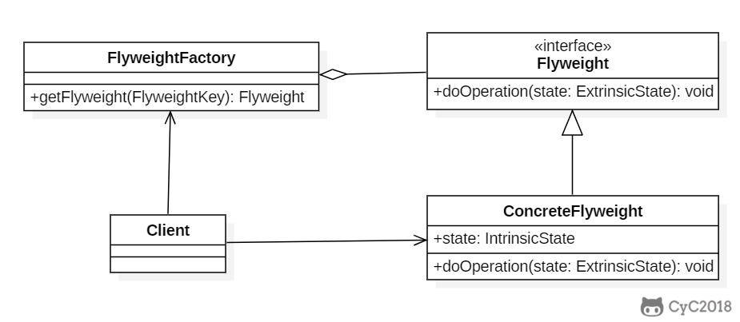

## 模式原理

Flyweight（轻量级），享元=共享元对象。

目标：共享细粒度对象。



## 模式设计

在 FlyweightFactory 中用一个 HashMap 维护 Flyweight，`getFlyweight()` 时会返回相同 key 的 Flyweight。

等于是把之前用过的 Flyweight 都存起来，后续出现同样的 Flyweight 就可以直接拿出来用，而不是重复创建对象。

```java
package com.hex.pattern.flyweight;

import java.util.HashMap;

/**
 * @Author: Hex
 * @Date: 2024/4/29 19:14
 * @Version: 1.0
 * @Description: 享元模式的实现
 */
public class FlyweightDemo {
    public static void main(String[] args) {
        // 享元模式，避免创建大量重复对象
        FlyweightFactory factory = new FlyweightFactory();
        Flyweight flyweight1 = factory.getFlyweight("aa");
        Flyweight flyweight2 = factory.getFlyweight("aa");
        flyweight1.operation("x");
        flyweight2.operation("y");
    }
}

/**
 * 享元模式
 */
class Flyweight {
    private String intrinsicState;

    public Flyweight(String intrinsicState) {
        this.intrinsicState = intrinsicState;
    }

    public void operation(String extrinsicState) {
        System.out.println("Object address: " + System.identityHashCode(this));
        System.out.println("IntrinsicState: " + intrinsicState);
        System.out.println("ExtrinsicState: " + extrinsicState);
    }
}

class FlyweightFactory {
    private HashMap<String, Flyweight> flyweights = new HashMap<>();

    Flyweight getFlyweight(String intrinsicState) {
        if (!flyweights.containsKey(intrinsicState)) {
            Flyweight flyweight = new Flyweight(intrinsicState);
            flyweights.put(intrinsicState, flyweight);
        }
        return flyweights.get(intrinsicState);
    }
}
```

## 模式应用

- java.lang.Integer#valueOf(int)
- java.lang.Boolean#valueOf(boolean)
- java.lang.Byte#valueOf(byte)
- java.lang.Character#valueOf(char)
