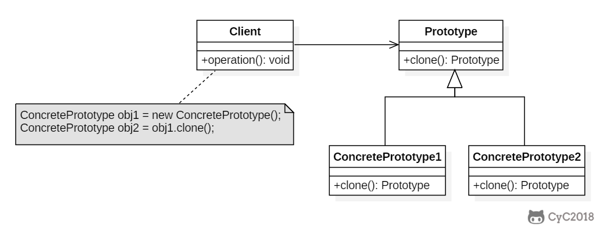

## 模式原理

目标：通过复制这个原型来创建新对象。



## 模式实现

```java
package com.hex.pattern.prototype;

/**
 * @Author: Hex
 * @Date: 2024/4/26 17:15
 * @Version: 1.0
 * @Description: 原型模式的实现
 */
public class PrototypeDemo {
    private String field;

    public PrototypeDemo(String field) {
        this.field = field;
    }

    public PrototypeDemo cloneObject() {
        return new PrototypeDemo(field);
    }

    @Override
    public String toString() {
        return "PrototypeDemo{" +
                "this=" + this.hashCode() +
                ", field='" + field +
                '}';
    }

    public static void main(String[] args) {
        PrototypeDemo pd = new PrototypeDemo("hello");
        PrototypeDemo pd1 = pd.cloneObject();
        System.out.println(pd);
        System.out.println(pd1);
    }
}
```

## 模式应用

- [java.lang.Object#clone()](http://docs.oracle.com/javase/8/docs/api/java/lang/Object.html#clone%28%29)