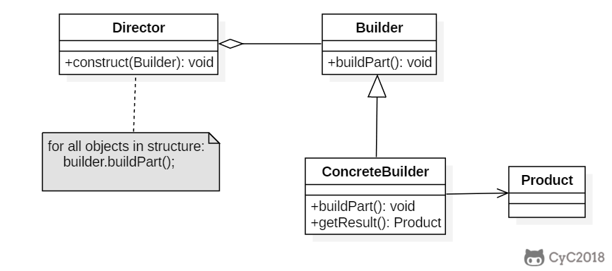

## 模式原理

目标：封装对象创建的过程，按步骤构造。



## 模式实现

```java
package com.hex.pattern.builder;

/**
 * @Author: Hex
 * @Date: 2024/4/27 17:34
 * @Version: 1.0
 * @Description: 建造者模式的实现
 */
public class BuilderDemo {
    public static void main(String[] args) {
        Builder builder = new Builder(new Product());
        builder.buildPartA();
        builder.buildPartB();
        System.out.println(builder.getProduct());
    }
}

class Builder {
    private Product product;

    public Builder(Product product) {
        this.product = product;
    }

    public void buildPartA() {
        product.setA("build product part a");
    }

    public void buildPartB() {
        product.setB("build product part b");
    }

    public Product getProduct() {
        return product;
    }
}

class Product {
    private String a;
    private String b;

    public String getA() {
        return a;
    }

    public void setA(String a) {
        this.a = a;
    }

    public String getB() {
        return b;
    }

    public void setB(String b) {
        this.b = b;
    }

    @Override
    public String toString() {
        return "Product{" + "a='" + a + '\'' + ", b='" + b + '\'' + '}';
    }
}
```

## 模式应用

- [java.lang.StringBuilder](http://docs.oracle.com/javase/8/docs/api/java/lang/StringBuilder.html)
- [java.nio.ByteBuffer](http://docs.oracle.com/javase/8/docs/api/java/nio/ByteBuffer.html#put-byte-)
- [java.lang.StringBuffer](http://docs.oracle.com/javase/8/docs/api/java/lang/StringBuffer.html#append-boolean-)
- [java.lang.Appendable](http://docs.oracle.com/javase/8/docs/api/java/lang/Appendable.html)
- [Apache Camel builders](https://github.com/apache/camel/tree/0e195428ee04531be27a0b659005e3aa8d159d23/camel-core/src/main/java/org/apache/camel/builder)
