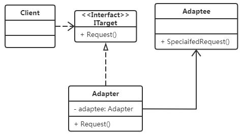

# 适配器模式 Adapter

## 模式原理


目标：A、C之间不适配，增加B作为适配器。


## 模式实现

- 类适配器就是继承，对目标类多一层封装。
- 对象适配器就是

### 1. 类适配器

```java
package com.hex.pattern;

import java.util.Date;
import java.util.Random;

/**
 * @Author: Hex
 * @Date: 2024/4/28 20:19
 * @Version: 1.0
 * @Description: 适配器模式的实现
 */
public class ClassAdapterDemo {
    public static void main(String[] args) {
        // 没有适配者的写法
        TargetClass target = new TargetClass();
        AdapteeClass adaptee = new AdapteeClass();
        // adaptee.adapteeMethod(target.targetMethod());
        // 这里肯定会报错，虽然只是类型转换，如果是更复杂的情况呢？

        // 类适配器
        ClassAdapter adapter = new ClassAdapter();
        adaptee.adapteeMethod(adapter.adapterMethod());
    }
}

/**
 * 目标类：返回Int
 */
class TargetClass {
    public Integer targetMethod() {
        return new Random(new Date().getTime()).nextInt();
    }
}

/**
 * 适配者类：入参String
 */
class AdapteeClass {
    public void adapteeMethod(String s) {
        System.out.println(s);
    }
}

/**
 * 适配器类：接收Int，返回String
 */
class ClassAdapter extends TargetClass {

    public String adapterMethod() {
        Integer i = super.targetMethod();
        return "\"" + i.toString() + "\"";
    }
}
```

### 2. 对象适配器



```java
package com.hex.pattern.adaptor;

import java.util.Date;
import java.util.Random;

/**
 * @Author: Hex
 * @Date: 2024/4/28 20:48
 * @Version: 1.0
 * @Description:
 */
public class ObjectAdapterDemo {
    public static void main(String[] args) {
        // 没有适配者的写法
        TargetClazz target = new TargetClazz();
        Adaptee adaptee = new Adaptee();
        // adaptee.adapteeMethod(target.targetMethod());
        // 这里肯定会报错，虽然只是类型转换，如果是更复杂的情况呢？

        // 对象适配器
        Adapter adapter = new Adapter(target);
        adaptee.adapteeMethod(adapter.adapterMethod());
    }
}

/**
 * 目标类：返回Int
 */
class TargetClazz {
    public Integer targetMethod() {
        return new Random(new Date().getTime()).nextInt();
    }
}

/**
 * 适配者类：入参String
 */
class Adaptee {
    public void adapteeMethod(String s) {
        System.out.println(s);
    }
}

/**
 * 适配器类：接收Int，返回String
 */
class Adapter {

    private TargetClazz target;

    public Adapter(TargetClazz target) {
        this.target = target;
    }


    public String adapterMethod() {
        Integer i = target.targetMethod();
        return "\"" + i.toString() + "\"";
    }

}
```

### 3. 总结（最佳实践）

推荐使用对象适配器。
- 因为类继承本身就是有缺陷的，会继承大量东西，而不管子类需不需要。
- 而对象适配器

## 模式应用

- [java.util.Arrays#asList()](http://docs.oracle.com/javase/8/docs/api/java/util/Arrays.html#asList%28T...%29)
- [java.util.Collections#list()](https://docs.oracle.com/javase/8/docs/api/java/util/Collections.html#list-java.util.Enumeration-)
- [java.util.Collections#enumeration()](https://docs.oracle.com/javase/8/docs/api/java/util/Collections.html#enumeration-java.util.Collection-)
- [javax.xml.bind.annotation.adapters.XMLAdapter](http://docs.oracle.com/javase/8/docs/api/javax/xml/bind/annotation/adapters/XmlAdapter.html#marshal-BoundType-)