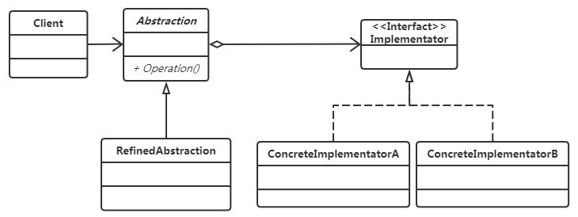

## 模式原理

目标：抽象与实现分离。



## 模式实现

```java
package com.hex.pattern.bridge;

/**
 * @Author: Hex
 * @Date: 2024-04-28 21:11
 * @Version: 1.0
 * @Description: 桥接模式的实现
 */
public class BridgeDemo {
    public static void main(String[] args) {
        // 具体实现角色
        IImplementor iImplementor = new ConcreteImplementorA();
        // 抽象角色
        Abstraction abstraction = new RefinedAbstraction(iImplementor);
        // 屏蔽了具体实现
        abstraction.operation();
    }
}

/**
 * 实现角色
 */
interface IImplementor {
    void operationImpl();
}

/**
 * 具体实现角色A
 */
class ConcreteImplementorA implements IImplementor {

    @Override
    public void operationImpl() {
        System.out.println("具体实现角色A");
    }
}

/**
 * 具体实现角色B
 */
class ConcreteImplementorB implements IImplementor {

    @Override
    public void operationImpl() {
        System.out.println("具体实现角色B");
    }
}

/**
 * 抽象角色（桥接类）
 */
abstract class Abstraction {
    protected IImplementor iImplementor;

    public Abstraction(IImplementor iImplementor) {
        this.iImplementor = iImplementor;
    }

    public void operation() {
        iImplementor.operationImpl();
    }
}

/**
 * 修正抽象角色（非必须）
 */
class RefinedAbstraction extends Abstraction {

    public RefinedAbstraction(IImplementor iImplementor) {
        super(iImplementor);
    }

    @Override
    public void operation() {
        super.operation();
        System.out.println("修正抽象角色");
    }
}
```

## 模式应用

- AWT (It provides an abstraction layer which maps onto the native OS the windowing support.)
- JDBC