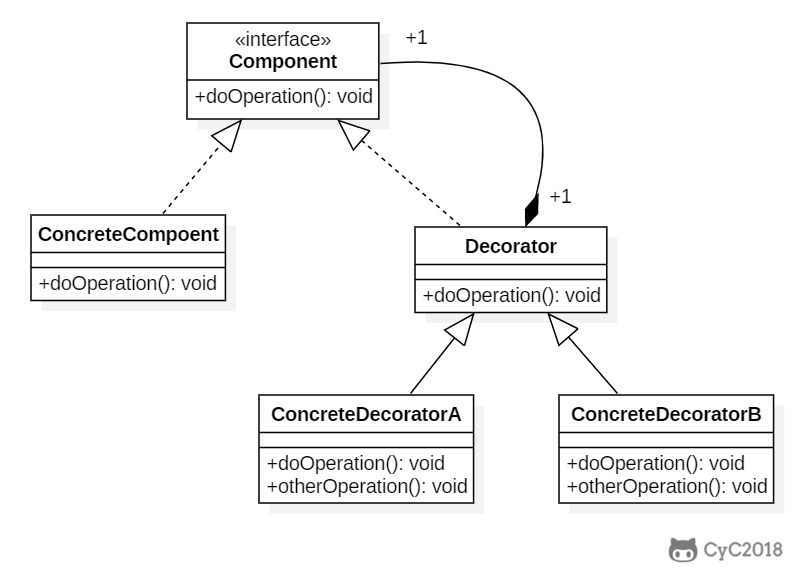

# 装饰器模式 Decorator

## 模式原理

目标：给对象动态添加功能。实际上是对对象的层层包装。



## 模式实现

```java
package com.hex.pattern.decorator;

/**
 * @Author: Hex
 * @Date: 2024-04-29 16:04
 * @Version: 1.0
 * @Description: 装饰器模式的实现
 */
public class DecoratorDemo {
    public static void main(String[] args) {
        IComponent component = new ConcreteComponent();
        System.out.println(component.operation(5));
        System.out.println(component.operation(-5));

        IComponent component1 = new Decorator(component);
        System.out.println(component1.operation(5));
        System.out.println(component1.operation(-5));
    }
}

interface IComponent {
    Double operation(int num);
}

class ConcreteComponent implements IComponent {

    @Override
    public Double operation(int num) {
        return Math.pow(num, 3);
    }
}

class Decorator implements IComponent {

    private IComponent component;

    public Decorator(IComponent component) {
        this.component = component;
    }


    @Override
    public Double operation(int num) {
        // 装饰器：在不改变原对象的前提下，增强或修改对象的功能
        // 本来是计算立方，改成了计算绝对值的立方
        num = Math.abs(num);
        return component.operation(num);
    }
}
```

## 模式应用

- java.io.BufferedInputStream(InputStream)
- java.io.DataInputStream(InputStream)
- java.io.BufferedOutputStream(OutputStream)
- java.util.zip.ZipOutputStream(OutputStream)
- java.util.Collections#checked[List|Map|Set|SortedSet|SortedMap]()
